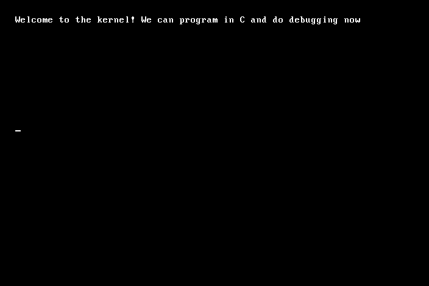

# 64 bit OS bare bones

Loosely following these resources:
- <https://github.com/cfenollosa/os-tutorial>
  - This is inspired by this document: [Writing a Simple Operating System — from Scratch](https://www.cs.bham.ac.uk/~exr/lectures/opsys/10_11/lectures/os-dev.pdf)
- <https://github.com/gmarino2048/64bit-os-tutorial>
- <https://dev.to/frosnerd/writing-my-own-boot-loader-3mld>

## Usage

```
$ make run
nasm -f bin -o boot/boot.bin boot/boot.asm
nasm -f elf64 -o kernel/entry.o kernel/entry.asm
clang -c -ffreestanding -target x86_64-none-elf -o kernel/kernel.o kernel/kernel.c
clang-15: warning: argument unused during compilation: '--gcc-toolchain=/nix/store/p975i9blgmkjfxpnlvdmm0xvjg573b6l-gcc-12.2.0' [-Wunused-command-line-argument]
ld.lld -o kernel/kernel.bin -Ttext 0x8200 --oformat binary kernel/entry.o kernel/kernel.o
cp boot/boot.bin ./os.img
cat kernel/kernel.bin >> os.img
ALERT: Adjust boot sector to load 3 sectors
qemu-system-x86_64 -drive format=raw,file=os.img
```


